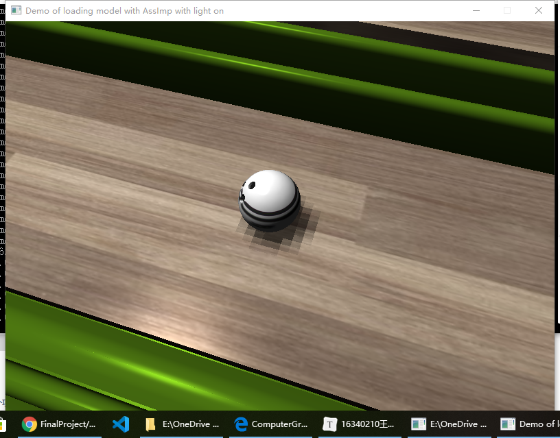

# 期末个人报告

小组项目主要负责基础部分，即：

+ shadow mapping
+ texture mapping
+ 运动控制
+ Camera视角设置
+ 部分碰撞设置

### shadow mapping

主要采用方式是阴影贴图，主要的阴影渲染对象为保龄球和球瓶。

主要的难点在于由于场景模型本身的复杂性，导致阴影在渲染过程中的干扰较多，加之仅仅采用了简单的抗锯齿效果，因此阴影的据此效果较为明显。



### `运动控制`

对于保龄球的运动控制，由movecontroller类来控制，该类负责保龄球的速度更新和运动方向的更新。其维护以下几个变量：

```c++
float speech_u;//保龄球的摩擦因子
glm::vec3 dirction;//球的运动方向
glm::vec3 coord;//求当前围绕旋转轴
glm::vec3 changeValue;//方向改变值
float speech;//求得速度大小值
glm::vec4 wall;//存储墙壁的位置
bool move;//决定当前球是否可以运动
```

随着用户输入的不同，该类控制着球的各个量的改变，并及时更新球的状态。主要的main函数中涉及到的控制球的运动更新状态：

```c++
//设置保龄球视角下的摄像机属性
		if (Move.move) {
			if (Move.speech > 0) {
				Move.updateSpeech(deltaTime);
				offset += Move.changeValue;
				objModel.move_ball(Move.changeValue*1000.0f);
				angle += Move.dirction.x > 0 ? -10*(Move.speech/0.03): 10 * (Move.speech / 0.03);
				coord = Move.coord;
				collision(Move.wall);
			}
		}
```


### camera视角设置

该部分主要在于合理设置生成view矩阵的几个量，即摄像机位置、目标方向以及合理的上向量，通过这三个量的合理切换实现视角的变换。决定当前睡觉通过一个enum对象那个来决定：

```c++
enum ViewPort {
	FREE,//自由视角
	BOWLING,//保龄球视角
};
```

而camera中分别为两个视角维护者对应的变量。当决定视角的变量取对应的值时，摄像机会采用对应的量来生成对应的观察矩阵。该改变视角变量的值：

```c++
if (keyPressedStatus[GLFW_KEY_P]) {
		viewfrom = BOWLING;
	}
if (keyPressedStatus[GLFW_KEY_L]) {
		viewfrom = FREE;
	}
```


### 碰撞：地板与球

对于碰撞，我并没有采用一般的设置碰撞体来进行检测，而是直接在模型的网格加载过程中在渲染时，对求和地板的网格坐标进行判断，一次来检测是否发生碰撞，并在碰撞发生时改变球的运动状态。

### 问题和解决

以上都是项目的basic部分，遇到的问题很多，比如阴影的据此、球的滚动与运动距离的一致性和运动速度设置与帧的相互协调等。以上问题都采用了一些办法去解决，但效果上还是有一些不协调。